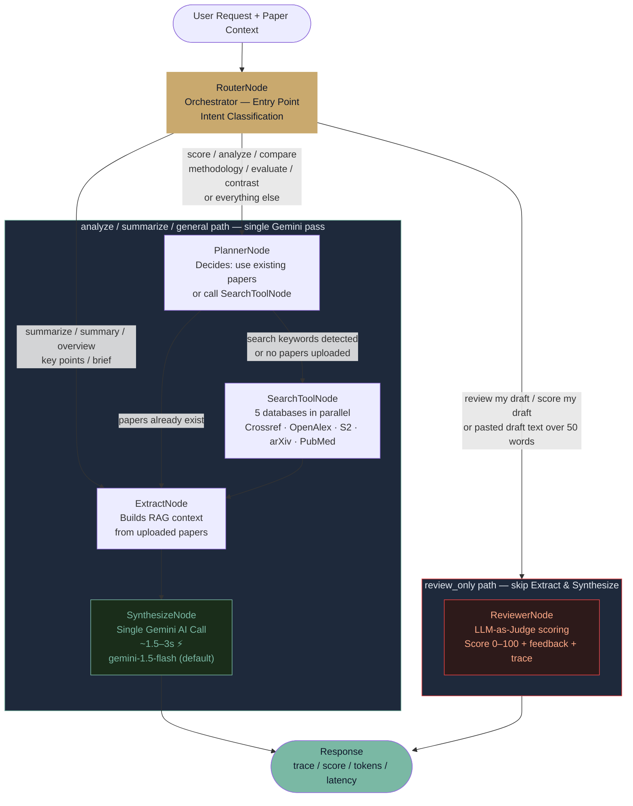
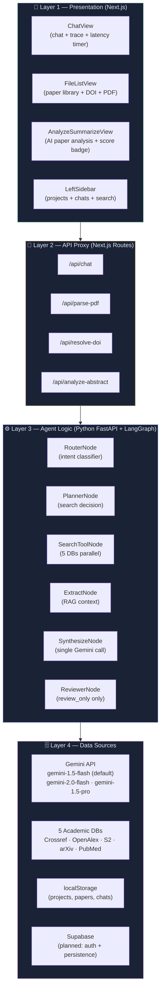

# LitAssist — Monday Meeting Presentation Plan
**Goal: Review Business Value & Tech Flow**
*Mentor expects: Problem Statement · Proposal · Business Value · Tech Platform · Agent Diagram · AWS · Layered Architecture*

> **Last Updated:** August 8, 2026 — corrected to match live `graph.py` implementation

---

## 1. Problem Statement

> **Undergraduate researchers spend 60–70% of their thesis timeline on one chapter: the Review of Related Literature (RRL).**

The RRL is a mandatory academic section that requires students to:
- Manually search across dozens of databases (Google Scholar, Semantic Scholar, PubMed, arXiv)
- Read and synthesize 20–50+ academic papers into coherent, cited prose
- Format APA citations, identify research gaps, and spot methodological patterns

**Pain points:**
| Problem | Impact |
|---|---|
| No unified search across databases | Students miss critical papers |
| Manual reading of 50+ papers | Takes weeks of non-research time |
| No AI-assisted synthesis | Draft quality depends on student's writing level |
| No quality scoring system | No feedback before submission |

---

## 2. Proposal

**LitAssist** is an AI-powered, multi-agent RRL assistant built on LangGraph + Gemini AI.

Instead of replacing the researcher, it acts as an **intelligent research co-pilot** that:
- **Searches** across 5 academic databases simultaneously (Crossref, OpenAlex, Semantic Scholar, arXiv, PubMed)
- **Extracts & resolves** paper metadata from DOI lookup and AI-powered PDF parsing
- **Classifies intent** (analyze vs. summarize vs. review draft vs. general chat) and routes to the right sub-pipeline
- **Synthesizes** academic RRL drafts with proper citations
- **Peer-reviews** user-submitted drafts with LLM-as-Judge scoring (0–100) with auto-retry loop

---

## 3. Business Value

| Dimension | Value |
|---|---|
| **Time savings** | Reduces RRL drafting from weeks to hours |
| **Accessibility** | Democratizes quality academic writing for non-expert researchers |
| **Quality guardrail** | AI reviewer provides consistent, rubric-based draft scoring |
| **Transparency** | Full observability (trace logs, token counts, latency) — no black-box synthesis |
| **Scalability** | Multi-project library, DOI resolution, PDF ingestion — scales from 1 paper to 100+ |
| **Reliability** | Clear quota error messages; user selects fallback model from dropdown — no silent crashes |

**Target Market:** 500,000+ undergraduate and graduate thesis researchers annually in the Philippines alone (CHED-enrolled institutions).

---

## 4. Tech Platform Overview

**Stack:**

| Layer | Technology |
|---|---|
| Frontend | Next.js 14 (App Router) + React + TypeScript |
| Styling | Vanilla CSS Modules, Google Fonts (Fraunces, DM Sans) |
| API Proxy | Next.js `/api/` routes → FastAPI backend |
| Backend | Python FastAPI + Uvicorn |
| Agent Framework | **LangGraph** `StateGraph` (multi-agent router pipeline) |
| LLM Provider | Google Gemini (`gemini-1.5-flash`, `gemini-2.0-flash`, `gemini-1.5-pro`) via `langchain-google-genai` |
| PDF Parsing | `pypdf` + Gemini AI structured extraction |
| Academic APIs | Crossref · OpenAlex · Semantic Scholar · arXiv · PubMed (5 in parallel) |
| HTTP Client | `httpx` (async, `follow_redirects=True`) |
| Data Storage | `localStorage` (current) → **Supabase PostgreSQL** (planned) |
| Hosting | Vercel (Frontend) · AWS ECS / Lambda (Backend) |

---

## 5. Final Agent Flow Diagram

> **This matches the live `graph.py` implementation exactly.**



**RouterNode / Orchestrator Decision Table (live in `graph.py`):**

| User Input Signal | Classified Intent | Actual Path |
|---|---|---|
| `"review my draft"`, `"score my draft"`, `"peer review my draft"`, or pasted draft text (>50 words) | **review_only** | Router → **ReviewerNode directly** → END *(skip Extract & Synthesize)* |
| `summarize`, `summary`, `overview`, `key points`, `brief` | **summarize** | Router → Extract → Synthesize → END *(single LLM pass)* |
| `score`, `analyze`, `compare`, `methodology`, `evaluate`, `contrast`, `score this`, `rate this` | **analyze** | Router → Planner → [Search?] → Extract → Synthesize → END *(single LLM pass)* |
| Everything else (RRL drafting, questions, general chat, find papers) | **general** | Router → Planner → [Search?] → Extract → Synthesize → END *(single LLM pass)* |

> **Key design decision:** Only `review_only` triggers the ReviewerNode. All other intents complete in a **single Gemini call** via SynthesizeNode, which is why latency is ~1.5–3s instead of ~30s.

---

## 6. Layered Architecture — Cake Diagram



---

## 7. AWS Cloud Architecture (Planned Deployment)

```mermaid
flowchart LR
    USER(["👤 Researcher\n(Browser)"])

    subgraph AWS["☁️ AWS Cloud"]
        CF["CloudFront CDN\n(edge caching)"]

        subgraph VERCEL["Vercel"]
            NEXT["Next.js App\n(Frontend + API Proxy)"]
        end

        subgraph ECS["AWS ECS / Fargate"]
            FASTAPI["Python FastAPI\n+ LangGraph Pipeline"]
        end

        subgraph SECRETS["AWS Secrets Manager"]
            SEC["GEMINI_API_KEY\nSUPABASE keys"]
        end

        subgraph DB["Data Layer"]
            SB["Supabase\n(PostgreSQL + pgvector)"]
        end

        subgraph MON["Observability"]
            CW["CloudWatch Logs\n(trace, latency, score)"]
        end
    end

    EXT["External APIs\nCrossref · OpenAlex\nSemantic Scholar\narXiv · PubMed"]

    USER --> CF --> NEXT
    NEXT -->|"POST /api/chat etc."| FASTAPI
    FASTAPI --> EXT
    FASTAPI --> SB
    FASTAPI --> CW
    FASTAPI --> SEC

    style AWS fill:#1a2236,stroke:#f59e0b,color:#e2e8f0
    style VERCEL fill:#0f172a,stroke:#7ab8a4
    style ECS fill:#0f172a,stroke:#c9a96e
    style DB fill:#0f172a,stroke:#8b9cf4
    style MON fill:#0f172a,stroke:#b07ab8
```



**AWS Services for LitAssist:**

| Service | Usage |
|---|---|
| **ECS / Fargate** | Containerized FastAPI + LangGraph backend (auto-scaling, serverless) |
| **CloudFront** | CDN for Next.js static assets (low-latency global access) |
| **Secrets Manager** | Secure storage for `GEMINI_API_KEY` and `SUPABASE_SERVICE_ROLE_KEY` |
| **CloudWatch** | Centralized log storage for agent trace logs, latency, review scores |
| **ECR** | Docker image registry for the FastAPI container |
| **Route 53** | DNS for custom domain (`litassist.app`) |
| **(Optional) S3** | PDF upload storage for multi-user persistence |

---

## 8. Slide-by-Slide Checklist

| Slide | Content | Status |
|---|---|---|
| **1. Problem Statement** | 60–70% thesis time = RRL; manual, fragmented, slow | ✅ Ready |
| **2. Proposal / Solution** | Multi-agent RRL assistant — RouterNode orchestrates 4 intents | ✅ Ready |
| **3. Business Value** | Time savings, quality guardrail, transparency, scalability | ✅ Ready |
| **4. Tech Platform** | Stack table: Next.js + FastAPI + LangGraph + Gemini + 5 DBs | ✅ Ready |
| **5. Final Agent Flow Diagram** | RouterNode → 2 paths: review_only (1 node) or standard (4 nodes, 1 LLM pass) | ✅ Corrected |
| **6. Layered Architecture (Cake)** | 4-layer cake: UI → Proxy → Agent Logic → Data | ✅ Updated |
| **7. AWS Diagram** | CloudFront → Vercel → ECS → Supabase → CloudWatch | ✅ Ready |
| **8. Live Demo** | ChatView → summarize → trace toggle → latency display | ✅ App running |
| **9. Observability** | Trace log, latency counter, token count — visible per message | ✅ Built & live |

---

## 9. Observability — What the Mentor Will See

**Example trace output (expand the Trace toggle in ChatView):**
```
[RouterNode     +1ms]  Orchestrator classified intent='summarize' → routing to ExtractNode: "Summarize selected literature..."
[PlannerNode    +2ms]  (summarize) Agent using existing 1 paper(s) — no tool call needed.
[ExtractNode    +3ms]  Context built: 1 project paper(s).
[SynthesizeNode +1487ms] Generated response via gemini-1.5-flash (~1203 tokens).
```

> Note: `ReviewerNode` trace line only appears when intent is `review_only` (user submitted a draft for scoring).

**Observable signals in UI:**
| Signal | Source | Where |
|---|---|---|
| Node trace log | Every node appends `[NodeName +Nms]` to `AgentState.trace` | Expandable Trace toggle |
| Model used | `model_name` from AgentState | Badge next to "LitAssist AI" |
| Live thinking timer | Interval counter in `ChatView` state | Typing indicator `(X.Xs)` |
| Response latency | Wall-clock ms from `run_litassist_graph()` | Latency display per message |
| Token usage | `SynthesizeNode` prompt + completion | Token count in message actions |
| Intent classified | `RouterNode` sets `intent` field | Visible in trace |

---

> [!IMPORTANT]
> **What to emphasize to the mentor Monday:**
> 1. **RouterNode is live** in `graph.py` — classifies `analyze`, `summarize`, `review_only`, and `general` intent and routes accordingly.
> 2. **All backend endpoints are wired** to the frontend: `/chat`, `/parse-pdf`, `/resolve-doi`, `/analyze-abstract`.
> 3. **Single-pass architecture** — most requests complete in one Gemini call (~1.5–3s) using `gemini-1.5-flash`.
> 4. **Quota error handling** — clear in-chat message asks user to switch model; no silent fallback or 500 crash.
> 5. **Next milestone**: Add Supabase for user accounts + paper/chat persistence.

> [!WARNING]
> **Demo prep:** Make sure the FastAPI backend is running at `http://localhost:8000` before presenting. Have the browser open with a project already loaded and at least 1 paper added to avoid cold-start delays during the live demo.

---

*Generated and maintained by LitAssist development sessions — Chrystel Anne Marcelo.*
