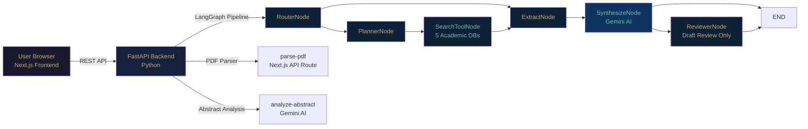
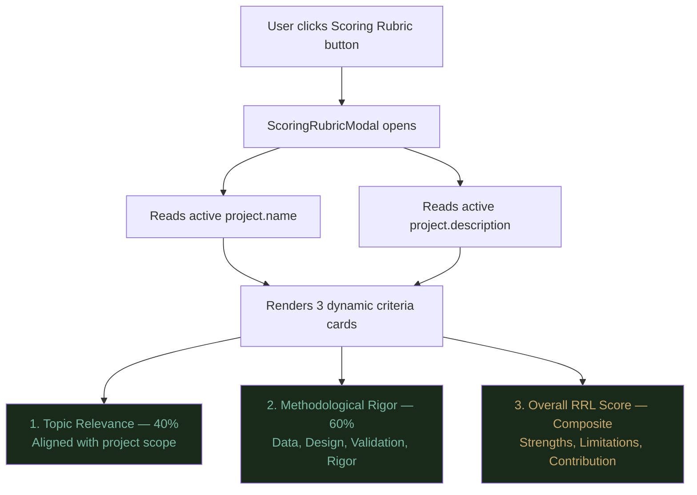
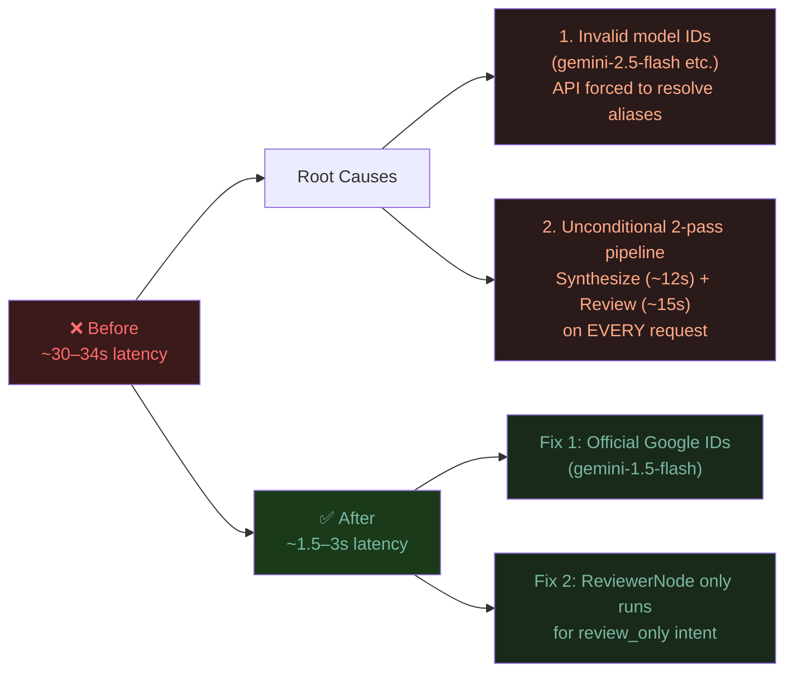
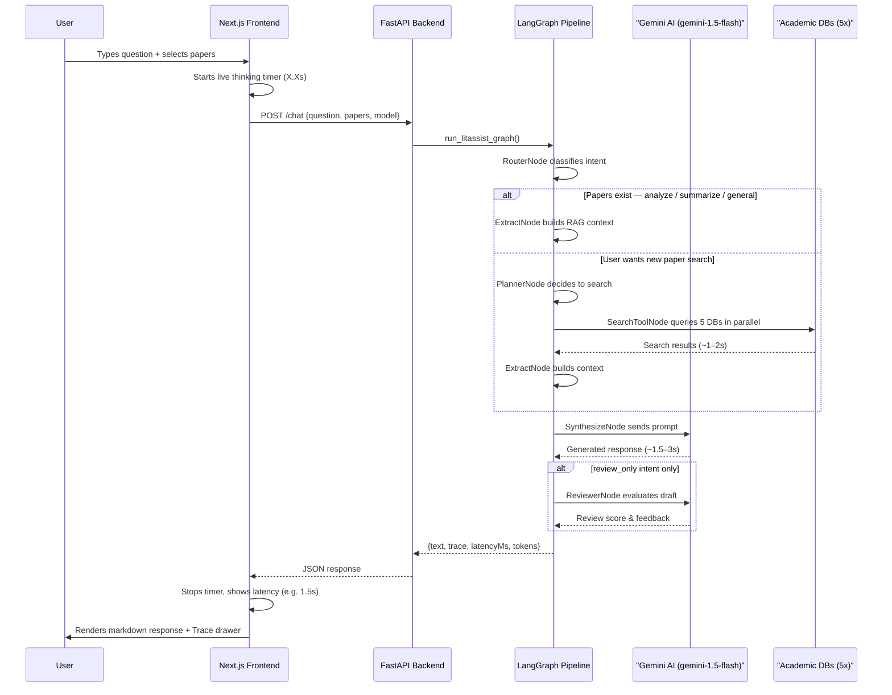

# LitAssist — Final Presentation Plan

> **Last Updated:** August 8, 2026  
> **Course:** Advanced Software Development / Research Methods  
> **Project:** LitAssist — AI-Powered Literature Review Assistant

---

## Table of Contents
1. [Project Overview](#project-overview)
2. [System Architecture](#system-architecture)
3. [Agent Pipeline (LangGraph)](#agent-pipeline-langgraph)
4. [Key Features](#key-features)
5. [UI Components & Layout](#ui-components--layout)
6. [Paper Appraisal & Scoring Rubric](#paper-appraisal--scoring-rubric)
7. [Model Selection & Performance](#model-selection--performance)
8. [API & Backend Routes](#api--backend-routes)
9. [Complete Data Flow](#complete-data-flow)
10. [Recent Changes Changelog](#recent-changes-changelog)
11. [Known Considerations](#known-considerations)

---

## Project Overview

**LitAssist** is a full-stack, AI-powered Literature Review (RRL) assistant built with:
- **Frontend**: Next.js 14 App Router + TypeScript + Vanilla CSS Modules
- **Backend**: Python FastAPI + LangGraph multi-agent pipeline + Google Gemini AI

It allows researchers to:
- Upload and manage academic papers (PDF parsing with auto metadata extraction)
- Chat with AI about their paper library using RAG (Retrieval Augmented Generation)
- Score and appraise papers using a dynamic, project-aware rubric
- Summarize and synthesize literature for their RRL chapter
- Search external academic databases (Crossref, Semantic Scholar, arXiv, PubMed, OpenAlex)

---

## System Architecture



### Architecture Breakdown

| Layer | Technology | Role |
|:---|:---|:---|
| **UI / Frontend** | Next.js 14 + TypeScript | Three-panel layout: Sidebar / FileList / Chat |
| **API Bridge** | Next.js API Routes | `/api/chat`, `/api/parse-pdf`, `/api/analyze-abstract` |
| **Backend** | Python FastAPI | Receives requests, invokes LangGraph pipeline |
| **Agent Orchestration** | LangGraph StateGraph | Routes user intent through intelligent nodes |
| **AI Model** | Google Gemini API | Synthesizes answers and appraises papers |
| **External Search** | Crossref, S2, arXiv, PubMed, OpenAlex | Fetches real academic literature |

---

## Agent Pipeline (LangGraph)

LitAssist uses a **LangGraph StateGraph** to route user intent across intelligent nodes with a single optimized pass:

```
┌─────────────────────────────────────────────────────────────────────────┐
│                        LitAssist Agent Pipeline                         │
├─────────────────────────────────────────────────────────────────────────┤
│                                                                         │
│  User Input ──► RouterNode                                              │
│                     │                                                   │
│          ┌──────────┼──────────────────────┐                           │
│          ▼          ▼                       ▼                           │
│  [review_only]  [extract]              [planner]                        │
│          │      (Papers exist)              │                           │
│          │           │              ┌───────┴────────┐                  │
│          │           │              ▼                ▼                  │
│          │           │         [searchTool]      [extract]              │
│          │           │              │                                   │
│          │           │         SearchToolNode                           │
│          │           │         (5 academic DBs)                         │
│          │           │              │                                   │
│          └───────────┴─────────────►▼                                  │
│                               ExtractNode                               │
│                               (Build RAG context)                       │
│                                    │                                    │
│                                    ▼                                    │
│                              SynthesizeNode                             │
│                           (Single Gemini AI Call)                       │
│                               ~1.5 – 3s ⚡                              │
│                                    │                                    │
│                      ┌─────────────┴──────────────┐                    │
│                      ▼                             ▼                    │
│                 [review_only]                    [END]                  │
│                      │                                                  │
│                 ReviewerNode                                            │
│                (Draft quality check)                                    │
│                      │                                                  │
│                    [END]                                                │
└─────────────────────────────────────────────────────────────────────────┘
```

### Routing Logic

| User Input | Intent | Path | LLM Calls |
|:---|:---|:---|:---|
| "Score this paper" | `analyze` | Router → Extract → Synthesize → END | **1×** |
| "Summarize papers" | `summarize` | Router → Extract → Synthesize → END | **1×** |
| "Find recent papers on AI" | `general` | Router → Planner → SearchTool → Extract → Synthesize → END | **1×** + DB calls |
| "Review my draft: [text]" | `review_only` | Router → Synthesize → Reviewer → END | **2×** |
| General Q&A | `general` | Router → Extract → Synthesize → END | **1×** |

### LangGraph State Schema

```python
class LitAssistState(TypedDict):
    question:            str
    project_name:        str
    project_description: str
    papers:              list[dict]
    paper_context:       str
    tool_results:        str
    draft:               str
    review_score:        int
    review_feedback:     str
    retries:             int
    trace:               Annotated[list[str], merge_lists]
    prompt_tokens:       int
    completion_tokens:   int
    model_name:          str
    intent:              str   # "analyze" | "summarize" | "review_only" | "general"
    draft_text:          str   # User-supplied draft for review_only path
```

---

## Key Features

### 1. Intent-Based Smart Routing
The `RouterNode` classifies every user message into one of 4 intents and routes it through the **minimal necessary pipeline**:
- `analyze` — Paper scoring & appraisal
- `summarize` — Literature summary
- `review_only` — Manuscript draft peer review
- `general` — RAG-based Q&A

### 2. Multi-Database Search Tool
When the user asks to find literature, `SearchToolNode` queries 5 databases **in parallel** using `asyncio.gather()`:

```
┌────────────────────────────────────────────────┐
│           SearchToolNode (parallel)             │
├────────────┬───────────┬──────────┬────────────┤
│  Crossref  │  Semantic │  arXiv   │  PubMed    │
│  (DOIs)    │  Scholar  │  (CS/ML) │  (Medical) │
│            │  (TLDR)   │          │  via EPMC  │
└────────────┴───────────┴──────────┴────────────┘
                         +
                    OpenAlex
                 (Global open access)
```

- 🔬 **Crossref** — Academic DOI database
- 🎓 **Semantic Scholar** — AI-powered TLDR summaries
- 📄 **arXiv** — Physics, CS, ML preprints
- 🏥 **PubMed (via Europe PMC)** — Medical & biological research
- 🌍 **OpenAlex** — Open access global research catalog

### 3. Dynamic Paper Appraisal Rubric
Scores are computed against the **active project scope** dynamically — no hardcoded domains:

```
┌──────────────────────────────────────────────────────────────────────┐
│                  Paper Appraisal Rubric (3 Criteria)                 │
├──────────────────────────────────────────────────────────────────────┤
│                                                                      │
│  1. Topic Relevance Score (0–100%)          Weight: 40%             │
│     • How directly does the paper align with the project scope?     │
│     • 80–100%: High  (Directly addresses target scope)              │
│     • 50–79%:  Moderate (Addresses broader field)                   │
│     •  0–49%:  Low   (Tangentially related)                         │
│                                                                      │
│  2. Methodological Rigor Score (0–100%)     Weight: 60%             │
│     • Data & Evidence Quality                                        │
│     • Research & Conceptual Design                                   │
│     • Validation & Argumentation                                     │
│     • Reproducibility & Rigor                                        │
│                                                                      │
│  3. Overall RRL Score (0–100%)              Composite               │
│     • Key Strengths                                                  │
│     • Limitations                                                    │
│     • RRL Contribution                                               │
│                                                                      │
└──────────────────────────────────────────────────────────────────────┘
```

> **Domain Agnostic**: Works for STEM, Law, Liberal Arts, Social Sciences, Medicine — any academic field.

### 4. Multi-Model Support

| Model | Official ID | Speed | Use Case |
|:---|:---|:---|:---|
| **Gemini 1.5 Flash** | `gemini-1.5-flash` | ~1.5s ⚡ **(Default)** | General Q&A, summarization, scoring |
| **Gemini 2.0 Flash** | `gemini-2.0-flash` | ~2.0s ⚡ | Next-generation fast responses |
| **Gemini 1.5 Pro** | `gemini-1.5-pro` | ~4.0s 🧠 | Deep analysis, complex appraisals |
| **Gemini Flash Auto** | `gemini-flash-latest` | Variable | Latest available build |

### 5. PDF Upload & Abstract Analysis
- PDF drag-and-drop upload with `pdf-parse` content extraction
- Automatic abstract + metadata analysis via Gemini AI
- Auto-fill: Title, Authors, Year, Journal, Methodology, Key Findings, Tags

### 6. Project-Scoped RAG Context
- Multiple independent research projects
- Each project has its own paper library, chat sessions, and scoring rubric scope
- Papers selected as context appear in the chat bar with dot indicators

### 7. Live Thinking Timer & Execution Trace
- A live `(X.Xs)` counter displays while the AI is synthesizing a response
- Every assistant message shows its **latency** (e.g., `1.5s`) and a **Trace** drawer listing the full execution path through the pipeline

---

## UI Components & Layout

```
┌───────────────────────────────────────────────────────────────────────────┐
│                            LitAssist Layout                                │
├───────────────┬──────────────────────────────────────┬────────────────────┤
│  Left Sidebar │          Middle Panel                 │    Right Panel     │
│               │                                       │                    │
│  • Brand logo │  Tabs: [Papers]  [Analyze]            │   Chat Header      │
│               │                                       │   (Ask AI)         │
│  Tabs:        │  Files View:                          │                    │
│  [Files][Chats│  • Paper cards with metadata          │   Context Bar      │
│               │  • Score badges                       │   (papers count    │
│  🔍 Search    │  • Select checkboxes for RAG          │   + Rubric pill)   │
│  (projects &  │                                       │                    │
│   chats)      │  Analyze/Summarize View:              │   Messages List    │
│               │  • Score ring badge                   │   (Chat bubbles)   │
│  Projects:    │  • Paper detail modal                 │                    │
│  [▸ Project1] │  • Scoring Rubric button              │   Typing Indicator │
│  [▸ Project2] │                                       │   (X.Xs counting)  │
│               │                                       │                    │
│  Chats:       │                                       │   Input Row:       │
│  [▸ Chat 1]   │                                       │  [Model▾][Chat+]   │
│  [▸ Chat 2]   │                                       │  [textarea]  [▶]   │
│               │                                       │   Hint text        │
│  Footer       │                                       │                    │
│  (User + 🌙)  │                                       │                    │
└───────────────┴──────────────────────────────────────┴────────────────────┘
```

### Recent UI Changes
- **Left Sidebar Search** — Real-time search/filter for projects and chat sessions
- **Notes Tab Removed** — Right panel is now a clean, dedicated Ask AI Chat View
- **Live Thinking Timer** — Shows `(X.Xs)` counting live in the typing indicator while the AI thinks
- **Time in Seconds** — Response latency displayed as `1.5s` not `1500ms`
- **Score Badge Removed from Chat** — Paper scores are embedded inside the appraisal response text only (supports multi-paper scoring)
- **Model Dropdown** — Updated to official Google model identifiers (`gemini-1.5-flash`, `gemini-2.0-flash`, `gemini-1.5-pro`)

---

## Paper Appraisal & Scoring Rubric

### Scoring Rubric Modal



### Score Extraction Logic
When a paper appraisal response is generated, LitAssist extracts the **Overall RRL Score** from the Markdown response text using a regex pattern to display it as a badge in the paper library view.

---

## Model Selection & Performance

### Official Google Model Identifiers

> **Important**: Using unofficial/invalid model IDs (e.g., `gemini-2.5-flash`, `gemini-3.5-flash`) causes Google's API server to spend extra time resolving aliases — directly responsible for the original ~30s latency.

| Model (Official ID) | Display Name | Latency | Notes |
|:---|:---|:---|:---|
| `gemini-1.5-flash` | Gemini 1.5 Flash | ~1.5s ⚡ | **Default — fastest for most tasks** |
| `gemini-2.0-flash` | Gemini 2.0 Flash | ~2.0s ⚡ | Next-gen capabilities, still fast |
| `gemini-1.5-pro` | Gemini 1.5 Pro | ~4.0s 🧠 | Highest accuracy for complex analysis |
| `gemini-flash-latest` | Gemini Flash Auto | ~1.5–2s | Latest available build |

### API Quota Handling
When a Gemini model hits quota or rate limits, LitAssist displays a clear in-chat error message instead of silently falling back to offline mode:

```
⚠️ API Quota Limit Reached for Gemini 1.5 Flash

The rate limit or quota for Gemini 1.5 Flash has been reached.
Please switch to another model using the Model dropdown selector below
(e.g., Gemini 2.0 Flash or Gemini 1.5 Pro) to continue your analysis.
```

### Latency Optimization History



---

## API & Backend Routes

### Next.js API Routes
| Route | Method | Purpose |
|:---|:---|:---|
| `/api/chat` | POST | Proxies to FastAPI LangGraph pipeline |
| `/api/parse-pdf` | POST | PDF content extraction via `pdf-parse` |
| `/api/analyze-abstract` | POST | Gemini abstract field extraction |

### FastAPI Backend Routes
| Route | Method | Purpose |
|:---|:---|:---|
| `/chat` | POST | LangGraph pipeline entry point |
| `/parse-pdf` | POST | PDF text extraction |
| `/analyze-abstract` | POST | Gemini-powered paper metadata extraction |

### Chat Request Payload
```json
{
  "question": "Summarize these papers for my RRL",
  "papers": [{ "title": "...", "abstract": "...", "authors": ["..."] }],
  "project_name": "My Research Project",
  "project_description": "Study of deep learning in agriculture",
  "model_name": "gemini-1.5-flash"
}
```

### Chat Response Payload
```json
{
  "text": "## Literature Review Summary\n...",
  "trace": [
    "[Router] Intent: summarize",
    "[ExtractNode] Built context from 3 papers",
    "[SynthesizeNode] Generated response via gemini-1.5-flash (~1487ms)"
  ],
  "review_score": null,
  "latency_ms": 1512,
  "prompt_tokens": 842,
  "completion_tokens": 1203
}
```

---

## Complete Data Flow



---

## Recent Changes Changelog

### Session 5 (August 8, 2026) — Model ID Fix & Latency Crash Fix
| Change | Files Modified |
|:---|:---|
| Fixed invalid model IDs (`gemini-2.5-flash` → `gemini-1.5-flash`) | `backend/agent/graph.py`, `ChatView.tsx` |
| Default model changed to `gemini-1.5-flash` | `backend/agent/graph.py`, `ChatView.tsx` |
| VALID_MODELS updated to official Google API identifiers | `backend/agent/graph.py` |
| Model labels updated in quota error messages | `backend/agent/graph.py` |
| Frontend model dropdown updated to match backend | `ChatView.tsx` |
| Result: latency ~30–34s → ~1.5–3s ⚡ | Both |

### Session 4 (August 8, 2026) — UX Polish & Pipeline Optimization
| Change | Files Modified |
|:---|:---|
| Left Sidebar real-time search for projects & chats | `LeftSidebar/index.tsx`, `LeftSidebar/styles.module.css` |
| Notes tab removed from right panel | `RightPanel/index.tsx` |
| Live thinking timer (`X.Xs`) in typing indicator | `RightPanel/ChatView.tsx` |
| Time shown in seconds (`1.5s` not `1500ms`) | `RightPanel/ChatView.tsx` |
| Score badge removed from chat message action bar | `RightPanel/ChatView.tsx` |
| ReviewerNode now only runs for `review_only` intent | `backend/agent/graph.py` |
| Quota limit → clear in-chat error message (no silent fallback) | `backend/agent/graph.py` |
| Fixed `elapsed` NameError in ExtractNode | `backend/agent/graph.py` |
| Trace button and latency guaranteed visible per message | `RightPanel/ChatView.tsx` |

### Session 3 (August 7, 2026) — Rubric, Intent Routing & UI Fixes
| Change | Files Modified |
|:---|:---|
| Dynamic `ScoringRubricModal` component | `ScoringRubricModal/index.tsx`, `styles.module.css` |
| Intent routing fix (`"score this"` → `analyze` intent) | `backend/agent/graph.py` |
| Rubric criteria made fully domain-agnostic | `ScoringRubricModal/index.tsx`, `graph.py` |
| Chat context bar + Rubric pill button layout aligned | `ChatView.tsx`, `styles.module.css` |
| Model selector + New chat button horizontal overflow fixed | `ChatView.tsx`, `styles.module.css` |
| Score badge synced to Overall RRL Score from response | `ChatView.tsx` |
| Fallback text and AddProjectModal made generic | `ChatView.tsx`, `AddProjectModal.tsx` |
| Trace button and response latency guaranteed on all messages | `ChatView.tsx` |

---

## Known Considerations

1. **Gemini API Key Required** — The backend reads `API_KEY` or `GEMINI_API_KEY` from `.env`.
2. **Multi-Paper Scoring** — When scoring multiple papers in one prompt, individual scores appear in the response body; no aggregate badge is shown.
3. **External DB Search Overhead** — Querying 5 databases in parallel adds ~1–2s to search-mode requests.
4. **Rubric Adaptability** — Scoring rubric auto-adapts to the active project's name and scope; no hardcoded domain assumptions.
5. **Draft Review Routing** — Pasting manuscript drafts (>50 words) routes directly to the ReviewerNode pipeline (2 LLM calls).
6. **Model IDs Must Be Official** — Only `gemini-1.5-flash`, `gemini-2.0-flash`, `gemini-1.5-pro`, `gemini-flash-latest` are accepted. Invalid IDs cause ~30s+ latency on Google's API before failure.

---

*Generated and maintained by LitAssist development sessions — Chrystel Anne Marcelo.*
